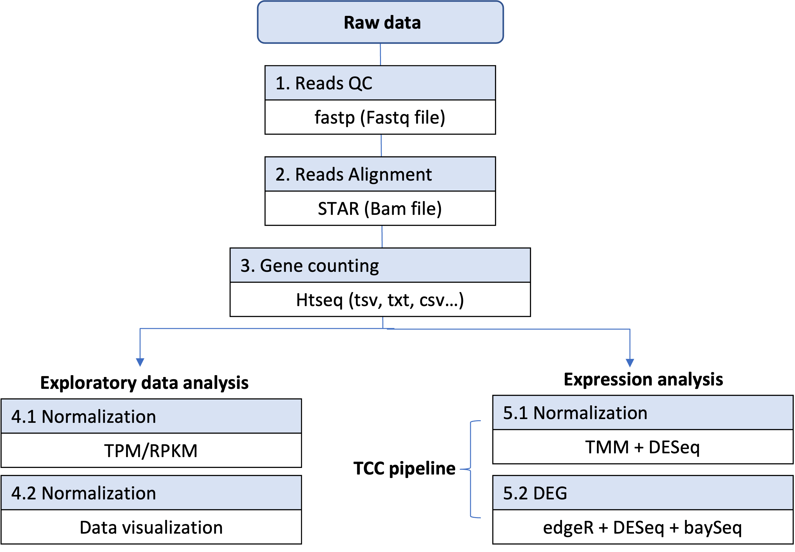
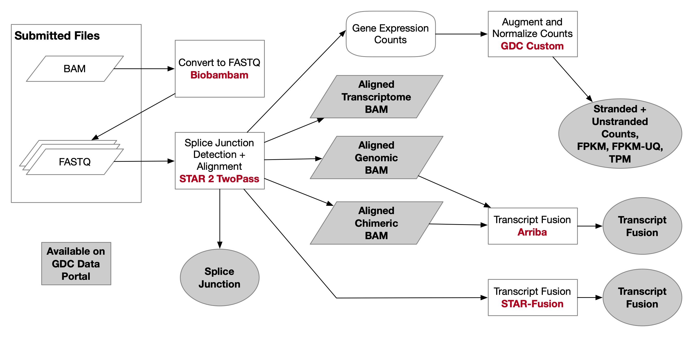
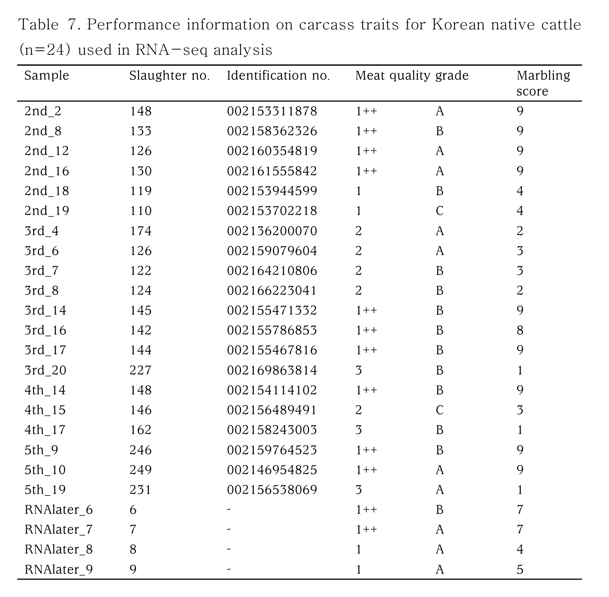
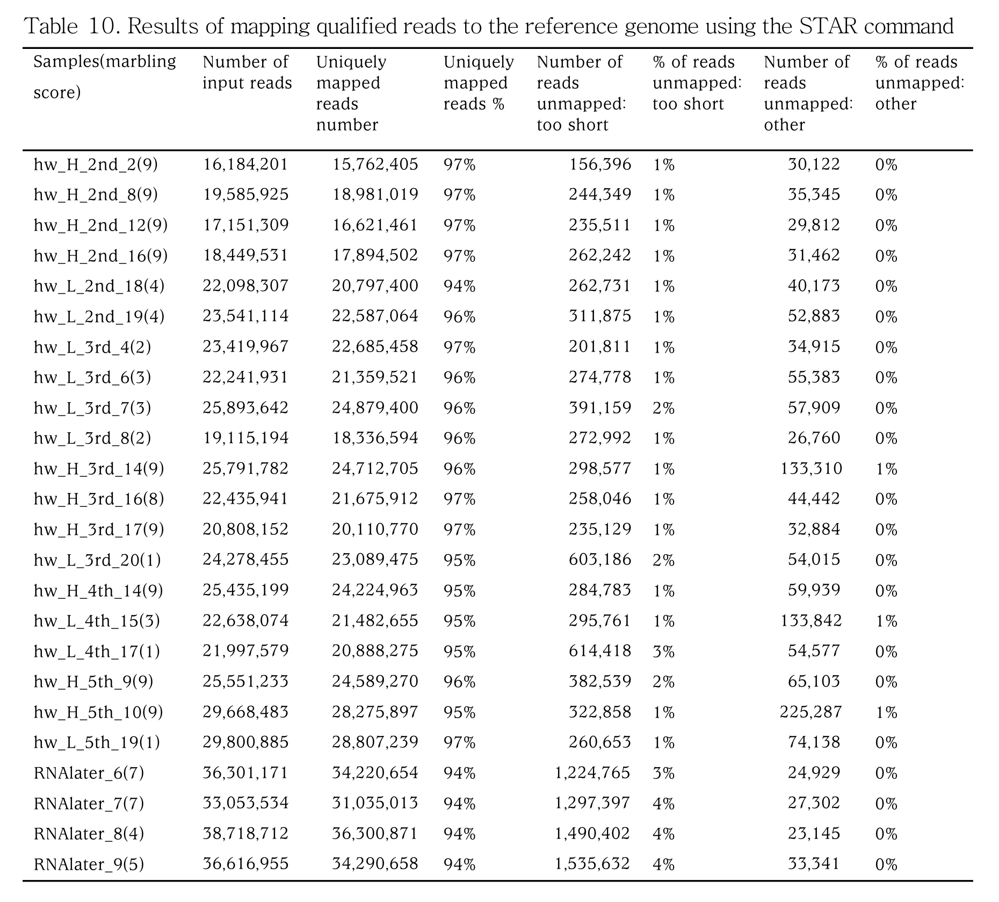
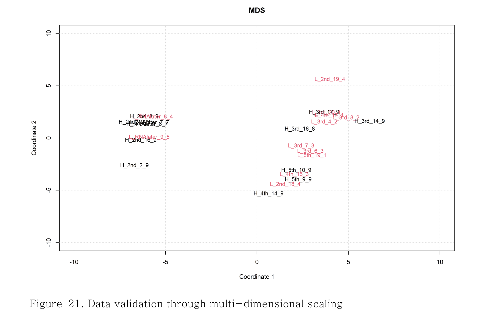
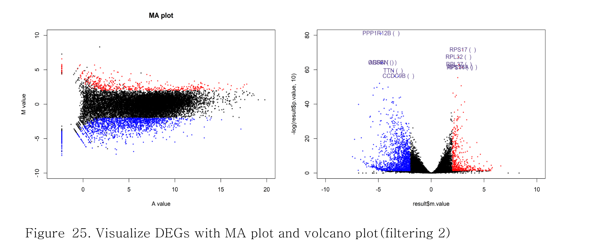
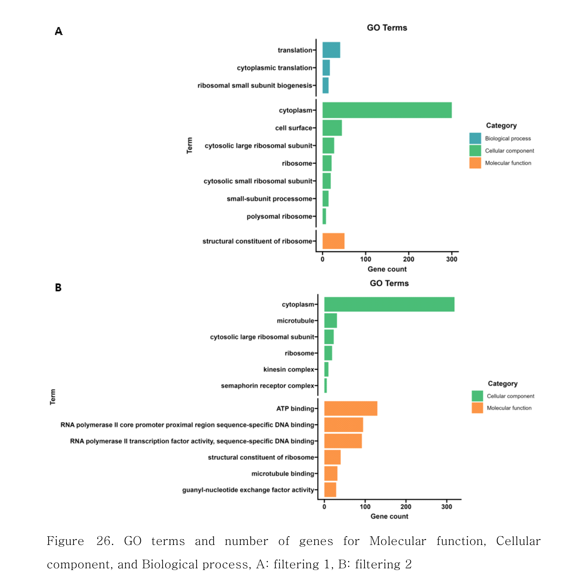
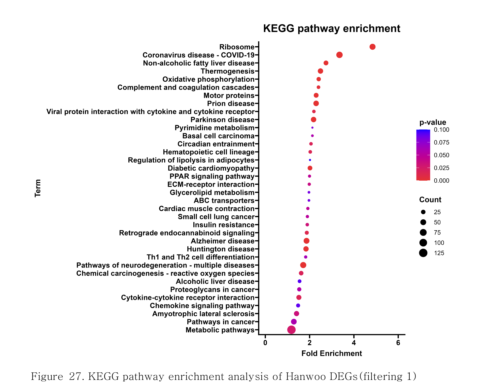

# RNA-seq DEG analysis
  - focusing on the analysing differential expression genes associated with the increasing of intramuscular fat deposition in Korean native cattle

## DEG Analysis pipeline




## 1. RNA library construction and NGS
## 1-1. Sample


## 2. Data pre-processing
## 2-1. Importing data and download reference genome data
```
$ cd /[directory_path]/fastp_input
$ gunzip *.fq.gz
```
```
add how to download bovine reference genome seq
```
  - Reference sequence  
  - UMD3.1 release 78      
    GenBank : GCA_000003055.5              
    RefSeq : GCF_000003055.6   
    Name : Bos_taurus_UMD_3.1.1 (Data Nov 25, 2014)    

  - bosTau9 (ARS_UCD1.2)     
    GenBank : GCA_002263795.2     
    RefSeq : GCF_002263795.1     
    Name : bosTau9 (NCBI Annotation Release 106)     

  - bosTau9 (ARS_UCD1.3)      
    GenBank : GCA_002263795.3   
    RefSeq : GCF_002263795.2   
    Name : NCBI eukaryotic genome annotation pipeline   

## 2-2. Quality contorl
```
$ for infile in *_1.fq; \
  do base=$(basename ${infile} _1.fq); \
  echo ${base}_1.fq; \
  done

$ for infile in *_1.fq; \
  do base=$(basename ${infile} _1.fq); \
  fastp \
  -i ${base}_1.fq \
  -I ${base}_2.fq \
  -o /[directory_path]/${base}_trimmed_1.fastq \
  -O /[directory_path]/${base}_trimmed_2.fastq \
  --detect_adapter_for_pe \
  --overrepresentation_analysis \
  --correction \
  --cut_right \
  --thread 12 \
  --html /[directory_path]/${base}_trimmed.fastp.html \
  --json /[directory_path]/${base}_trimmed.fastp.json; \
  done

$ mkdir fastq_results/
$ mv *.html /[directory_path]/fastp_results
$ mv *.json /[directory_path]/fastp_results
$ mkdir fastqc_results/
$ fastqc -o /[directory_path]/ *.fastq
```  
  - Viewing the FastQC results #check fastqc_html file out

## 3. Estimation of gene expression level
## 3-1. Building the STAR index
```
$ cd ncbi_dataset
$ STAR \
  --runThreadN 12 \
  --runMode genomeGenerate \
  --genomeDir /[directory_path]/index_gff \
  --genomeFastaFiles GCF_002263795.2_ARS-UCD1.3_genomic.fna \
  --sjdbGTFfile genomic.gff \
  --sjdbGTFtagExonParentTranscript Parent \
  --sjdbOverhang 149 
```
```
Parameter		Description
--runThreadN		Number of threads (processors) for mapping reads to a genome
--runMode		run mode for STAR. genomeGenerate mode builds genome index
--genomeDir		PATH to the directory where genome indices will be stored
--genomeFastaFiles	reference genome file in FASTA format. You can also provide multiple genome files (separated by space) for index building.
--sjdbGTFfile		GTF file for gene annotation. This is an optional parameter
--sjdbOverhang		length of reads around the splice junctions. The ideal values should read length - 1 (or max read length - 1). 
                        For example, if your read length is 150, the value should be 149. In most cases, 
                        the default value of 100 also works.
```

## 3-2. Mapping trimmed_fastq file to the ARS-UCD1.3 bovine reference genome
## 3-2-1 Description: STAR(Spliced Transcripts Alignment to a Reference) Aligner
  -. Seed searching : For every read that STAR aligns, STAR will search for the longest sequence that exactly matches one or more locations on the reference genome. These longest matching sequences are called the Maximal Mappable Prefixes (MMPs):
  -.Seed1(mapped to the reference genome), Seed2(Searching again for only unmapped portion of the read)
  -. Clustering, stitching and scoring : scoring based on mismatches, indels, gaps, etc. 
## 3-2-2 Two-pass alignment of RNA-seq reads with STAR
  -.The 1-pass mapping mode generates all required data essential for many downstream analyses such as differential gene expression analysis  
  -.robustly and accurately identify novel splice junction for differential splicing analysis and variant discovery

### 1) Mapping
```
$ cd 'trimmed data'
$ for infile in *_1.fastq; \
  do base=$(basename ${infile} _trimmed_1.fastq); \
  echo ${base}; \
  done 
$ for infile in *_1.fastq \
  ; do base=$(basename ${infile} _trimmed_1.fastq) \
  ; STAR \
    --runThreadN 12 \
    --genomeDir /[directory_path] \
    --sjdbGTFfile /[directory_path]/genomic.gff \
    --readFilesIn ${base}_trimmed_1.fastq ${base}_trimmed_2.fastq \
    --twopassMode Basic \
    --outFileNamePrefix /[directory_path]/${base}_ucd1.3_star_ \
    --outSAMtype BAM SortedByCoordinate \
  ; done

$ for infile in *_1.fastq; \
  do base=$(basename ${infile} _trimmed_1.fastq);
  STAR \
    --runThreadN 12 \
    --genomeDir /[directory_path] \
    --sjdbGTFfile /[directory_path]/genomic.gff \
    --readFilesIn ${base}_trimmed_1.fastq ${base}_trimmed_2.fastq \
    --twopassMode Basic \
    --outFileNamePrefix /[directory_path]/${base}_ucd1.3_star_ \
    --outSAMtype BAM SortedByCoordinate \
    --readFilesCommand zcat; \
  done

$ samtools view \
  ucd1.3_star_mapping_L_5th_19_ucd1.3_star_Aligned.sortedByCoord.out.bam|more
```
```
Parameter   description
--runThreadN		Number of threads (processors) for mapping reads to genome
--readFilesIn		Read files for mapping to the genome. In case of paired-end reads, provide read1 and read2 files. 
                        If there are multiple samples, separate files by a comma. For example, for paired-end reads, 
                        --readFilesIn S1read1.fastq,S2read1.fastq S1read2.fastq,S2read2.fastq
--genomeDir		PATH to the directory containing built genome indices
--outSAMtype 		'BAM SortedByCoordinate' Output coordinate sorted BAM file which is useful for many downstream analyses. This is optional.
--outSAMunmapped Within	Output unmapped reads from the main SAM file in SAM format. This is optional
--outFileNamePrefix	Provide output file prefix name
```
- STAR align하기(파일 형식에 맞는 옵션 사용): fastq파일, #gzip파일
- samtools view: view first few alignment of BAM files
- STAR output file 
```
Parameter   Description
seed_sampleAligned.sortedByCoord.out.bam	    Alignment in BAM format (sorted by coordinate)
seed_sampleLog.final.out			Alignment summary statistics such as uniquely mapped reads, percent mapping, number of unmapped reads, etc.
seed_sampleLog.out				Alignment log for commands and parameters (useful in troubleshooting)
seed_sampleLog.progress.out			Alignment progress report (e.g. number of reads processed during particular span of time, mapped and
						unmapped reads, etc.)
seed_sampleSJ.out.tab				Filtered splice junctions found during the mapping stage
```
  - Splice junctions.
```
SJ.out.tab contains high confidence collapsed splice junctions in tab-delimited format. Note that
STAR defines the junction start/end as intronic bases, while many other software define them as
exonic bases. The columns have the following meaning:
column 1: chromosome
column 2: first base of the intron (1-based)
column 3: last base of the intron (1-based)
column 4: strand (0: undefined, 1: +, 2: -)
column 5: intron motif: 0: non-canonical; 1: GT/AG, 2: CT/AC, 3: GC/AG, 4: CT/GC, 5:
AT/AC, 6: GT/AT
column 6: 0: unannotated, 1: annotated (only if splice junctions database is used)
column 7: number of uniquely mapping reads crossing the junction
column 8: number of multi-mapping reads crossing the junction
column 9: maximum spliced alignment overhang
The filtering for this output file is controlled by the --outSJfilter* parameters, as described in Section 14.16. Output Filtering: Splice Junctions.
```
```
$ iyoonseok95@yoonseok95:/mnt/sdb1/hanwoo_mRNA_DEG/umd3.1.1_star_mapping$ cat  hw_highlow_umd3.1.1SJ.out.tab|head
chromosome
AC_000158.1	125015	135819	2	2	1	6	0	71
AC_000158.1	136002	137157	2	2	1	12	0	66
AC_000158.1	137265	137833	2	2	1	9	0	66
AC_000158.1	137265	138874	2	2	0	1	0	13
AC_000158.1	137960	138874	2	2	1	5	0	75
AC_000158.1	138985	178432	2	2	1	3	0	70
AC_000158.1	242647	254558	1	1	0	2	0	41
AC_000158.1	242647	254564	1	1	0	1	0	59
AC_000158.1	242647	275622	1	1	0	9	0	58
AC_000158.1	242647	318512	1	1	0	2	0	56
```
-. Splice junctions.
SJ.out.tab contains high confidence collapsed splice junctions in tab-delimited format. Note that
STAR defines the junction start/end as intronic bases, while many other software define them as
exonic bases. The columns have the following meaning:
column 1: chromosome
column 2: first base of the intron (1-based)
column 3: last base of the intron (1-based)
column 4: strand (0: undefined, 1: +, 2: -)
column 5: intron motif: 0: non-canonical; 1: GT/AG, 2: CT/AC, 3: GC/AG, 4: CT/GC, 5:
AT/AC, 6: GT/AT
column 6: 0: unannotated, 1: annotated (only if splice junctions database is used)
column 7: number of uniquely mapping reads crossing the junction
column 8: number of multi-mapping reads crossing the junction
column 9: maximum spliced alignment overhang

$ for infile in *_SJ.out.tab; do base=$(basename ${infile} _SJ.out.tab); cat ${base}_SJ.out.tab | awk '($5 > 0 && $7 > 2 && $6==0)' | cut -f1-6 | sort | uniq > ${base}_SJ.out_filtered.tab; done
Before using splice junctions, you should filter out the likely false positives splice junctions such as junctions supported by very few reads (e.g. ≤ 2 reads), non-canonical junctions (The 0 value in column5 from SJ.out.tab denotes non-canonical junctions), and annotated junctions (The 1 value in column6 from SJ.out.tab denotes annotated junctions). The annotated junctions should be filtered out as they are already included in the gene annotation (GTF/GFF3 file).
### 2) Re-buliding genome index using SJ.out_filtered.tab file
```
$ cd ucd1.3_star_mapping

$ for infile in *_SJ.out.tab; \
  do base=$(basename ${infile} _SJ.out.tab); \
  echo ${base}; \
  done

$ cat hw_L_5th_19_ucd1.3_star_SJ.out.tab|more

$ for infile in *_SJ.out.tab; \
  do base=$(basename ${infile} _SJ.out.tab); \
  cat ${base}_SJ.out.tab \
  | awk '($5 > 0 && $7 > 2 && $6==0)' \
  | cut -f1-6 \
  | sort \
  | uniq > ${base}_SJ.out_filtered.tab; \
  done

$ cat *.tab \
| awk '($5 > 0 && $7 > 2 && $6==0)' \
| cut -f1-6 \
| sort \
| uniq > hw_highlow_SJ.out_filtered.tab

$ cd [directory_path]
```
### 3) Build genome index with filtered output 
```
$ STAR \
  --runThreadN 12 \
  --runMode genomeGenerate \
  --genomeDir /[directory_path]/star_index_filtering_2pass \
  --genomeFastaFiles GCF_002263795.2_ARS-UCD1.3_genomic.fna \
  --sjdbGTFfile genomic.gff \
  --sjdbFileChrStartEnd /[direcotry_path]/hw_highlow_SJ.out_filtered.tab \
  --sjdbOverhang 149
```



### 4) Mapping reads to the reference genome 2nd pass
```
$ cd 'trimmed data’

$ for infile in *_1.fastq; \
  do base=$(basename ${infile} _trimmed_1.fastq); \
  echo ${base}; \
  done

$ for infile in *_1.fastq; \
  do base=$(basename ${infile} _trimmed_1.fastq); \
  STAR \
  --runThreadN 12 \
  --readFilesIn ${base}_trimmed_1.fastq ${base}_trimmed_2.fastq \
  --genomeDir /[directory_path]/star_index_filtering_2pass/ \
  --outSAMtype BAM SortedByCoordinate \
  --outFileNamePrefix /[directory_path]/${base}_star2pass_filtered \
  --outSAMunmapped Within \
  --readFilesCommand zcat; \
  done

$ for infile in *_1.fastq; \
  do base=$(basename ${infile} _trimmed_1.fastq); \
  STAR \
  --runThreadN 12 \
  --readFilesIn ${base}_trimmed_1.fastq ${base}_trimmed_2.fastq \
  --genomeDir /[directory_path]/star_index_filtering_2pass/ \
  --outSAMtype BAM SortedByCoordinate \
  --outFileNamePrefix /[directory_path]/${base}_star2pass_filtered \
  --outSAMunmapped Within; \
  done

$ cat sample_5th_9_star2pass_filteredLog.final.out
```


## 4. Counting the read mapped to the reference genome sequence
### 4-1. Installation of htseq-count tool
```
$ pip install HTseq
```
### 4-2. Indexing bam file
```
$ cd [directory_paht]

$ for infile in *_filteredAligned.sortedByCoord.out.bam; \
  do base=$(basename ${infile} _filteredAli#!/bin/sh

#Create tabular info from GTF
cat genomic.gtf | \
awk 'BEGIN{FS="\t"}{split($9,a,";"); if($3~"gene") print a[1]"\t"a[5]"\t"$1":"$4"-"$5"\t"a[6]"\t"$7}' | \
sed 's/gene_id "//' | \
sed 's/gene "//' | \
sed 's/db_xref "//' | \
sed 's/gene_biotype "//' | \
sed 's/"//g' | \
awk 'BEGIN{FS="\t"}{split($3,a,"[:-]"); print $1"\t"$2"\t"a[1]"\t"a[2]"\t"a[3]"\t"$4"\t"$5"\t"a[3]-a[2];}' | \
sort -k3,3 -k4,4n -k5,5n | \
sed "1i\GeneID\tGene\tgene_id\tStart\tEnd\tClass\tStrand\tLength" \
> genomic.annotation_genes.txt

 LOC785541	GK000003.2	101173430	101176214	 pseudogene	+	2784
 TESK2		GK000003.2	101181509	101320775	 protein_coding	+	139266
 SPATA7		GK000010.2	101186186	101224038	 protein_coding	+	37852
 LOC100336936	GK000006.2	101195831	101271813	 pseudogene	+	75982
 LOC789459	GK000007.2	10120294	10122884	 pseudogene	+	2590
 LBX2		GK000011.2	10120952	10122607	 protein_coding	+	1655
 LOC506828	GK000005.2	101210292	101267000	 protein_coding	+	56708
 KCNIP3		GK000011.2	1012170	1014325	 protein_coding	-	2155
 LOC100298723	GK000030.2	101217311	101492856	 pseudogene	+	275545
 LOC100138361	GK000019.2	10123663	10125021	 pseudogene	-	1358
 PTPN21		GK000010.2	101236740	101309243	 protein_coding	-	72503
 LAMC3		GK000011.2	101246786	101315529	 protein_coding	+	68743

$ cat genomic.gtf | awk 'BEGIN{FS="\t"}{split($9,a,";"); if($3~"gene") print a[1]"\t"a[5]"\t"a[3]":"$4"-"$5"\t"a[6]"\t"$7}' 
gene_id "BOS_498"	 gene "LOC100337382"	 db_xref "GeneID:100337382":4-583	 gene_biotype "protein_coding"	-
gene_id "BOS_499"	 gene "LOC781231"	 db_xref "GeneID:781231":1-835	 gene_biotype "protein_coding"	-
gene_id "BOS_500"	 gene "LOC790833"	 db_xref "GeneID:790833":9-648	 gene_biotype "protein_coding"	-
gene_id "BOS_501"	 gene "LOC785656"	 db_xref "GeneID:785656":151-660	 gene_biotype "protein_coding"	+
gene_id "BOS_502"	 gene "LOC786233"	 db_xref "GeneID:786233":143-794	 gene_biotype "pseudogene"	+

iyoonseok95@yoonseok95://mnt/sdb1/hanwoo_mRNA_DEG/umd3.1.1_star2pass_htseq_count/normal$ cat genomic.gtf | head -10
#gtf-version 2.2
#!genome-build Bos_taurus_UMD_3.1.1
#!genome-build-accession NCBI_Assembly:GCA_000003055.5
GK000001.2	tpg	gene	20372	35558	.	+	.	gene_id "BOS_503"; transcript_id ""; db_xref "GeneID:100336696"; gbkey "Gene"; gene "LOC100336696"; gene_biotype "pseudogene"; locus_tag "BOS_503"; note "The sequence of the transcript was modified to remove a frameshift represented in this assembly."; pseudo "true"; 
GK000001.2	tpg	gene	66183	67115	.	-	.	gene_id "BOS_1"; transcript_id ""; db_xref "GeneID:787691"; gbkey "Gene"; gene "LOC787691"; gene_biotype "pseudogene"; locus_tag "BOS_1"; note "The sequence of the transcript was modified to remove frameshifts represented in this assembly."; pseudo "true"; 
GK000001.2	tpg	gene	70192	71121	.	-	.	gene_id "BOS_2"; transcript_id ""; db_xref "GeneID:787710"; gbkey "Gene"; gene "LOC787710"; gene_biotype "pseudogene"; locus_tag "BOS_2"; note "The sequence of the transcript was modified to remove frameshifts represented in this assembly."; pseudo "true"; 
GK000001.2	tpg	gene	124635	179713	.	-	.	gene_id "BOS_536"; transcript_id ""; db_xref "GeneID:507243"; gbkey "Gene"; gene "CLIC6"; gene_biotype "protein_coding"; locus_tag "BOS_536"; 
GK000001.2	tpg	transcript	124635	179713	.	-	.	gene_id "BOS_536"; transcript_id "unassigned_transcript_1"; db_xref "GeneID:507243"; gbkey "mRNA"; gene "CLIC6"; locus_tag "BOS_536"; product "chloride intracellular channel 6-like"; transcript_biotype "mRNA"; 
GK000001.2	tpg	exon	178433	179713	.	-	.	gene_id "BOS_536"; transcript_id "unassigned_transcript_1"; db_xref "GeneID:507243"; gene "CLIC6"; locus_tag "BOS_536"; product "chloride intracellular channel 6-like"; transcript_biotype "mRNA"; exon_number "1"; 
GK000001.2	tpg	exon	138875	138984	.	-	.	gene_id "BOS_536"; transcript_id "unassigned_transcript_1"; db_xref "GeneID:507243"; gene "CLIC6"; locus_tag "BOS_536"; product "chloride intracellular channel 6-like"; transcript_biotype "mRNA"; exon_number "2"; 


$1 GK000001.2	
$2 tpg	
$3 gene	
$4 20372	
$5 35558	
$6 .	
$7 +	
$8 .	
$9
a[1] gene_id "BOS_503"		; 
a[2] transcript_id ""		; 
a[3] db_xref "GeneID:100336696"	; 
a[4] gbkey "Gene"			; 
a[5] gene "LOC100336696"		; 
a[6] gene_biotype "pseudogene"	; 
a[7] locus_tag "BOS_503"		; 
a[8] note "The sequence of the transcript was modified to remove a frameshift represented in this assembly."; 
a[9] pseudo "true"


#gff.file format
AC_000158.1	Gnomon	gene	33293	35627	.	+	.	ID=gene0;Dbxref=GeneID:104970773;Name=LOC104970773;gbkey=Gene;gene=LOC104970773;gene_biotype=protein_coding

#gtf.file format
GK000001.2	tpg	gene	66183	67115	.	-	.	gene_id "BOS_1"; transcript_id ""; db_xref "GeneID:787691"; gbkey "Gene"; gene "LOC787691"; gene_biotype "pseudogene"; locus_tag "BOS_1"; note "The sequence of the transcript was modified to remove frameshifts represented in this assembly."; pseudo "true"; 

#command line
#cat gencode.v33.annotation.gtf | \
#awk 'BEGIN{FS="\t"}{split($9,a,";"); if($3~"gene") print a[1]"\t"a[3]"\t"$1":"$4"-"$5"\t"a[2]"\t"$7}' | \

a[1] gene_id "BOS_503"		; 
a[3] db_xref "GeneID:100336696"	; 
$1":"$4"-"$5" 
a[2] 		transcript_id ""		; 
$7 		+


cat genomic.gtf | awk 'BEGIN{FS="\t"}{split($9,a,";"); if($3~"gene") print a[1]"\t"a[5]"\t"a[3]":"$4"-"$5"\t"a[2]"\t"$7}'
gene_id "BOS_502"	 gene "LOC786233"	 db_xref "GeneID:786233":143-794	 transcript_id ""	+


gned.sortedByCoord.out.bam); \
  echo ${base}; \
  done

$ for infile in *_filteredAligned.sortedByCoord.out.bam; \
  do base=$(basename ${infile} _filteredAligned.sortedByCoord.out.bam); \
  samtools index ${base}_filteredAligned.sortedByCoord.out.bam; \
  done
```
### 4-3. Filtering genomic.gff file
```
$ cd /home/biolab302/바탕화면/jiyeon/ncbi_dataset/data/GCF_002263795.2

$ awk '/gene/' ./genomic.gff > genomic_gene.gff

$ cat genomic_gene.gff |more
```
### 4-4. mRNA quantification
```
$ cd /home/biolab302/바탕화면/jiyeon/analysis_file/ucd1.3_star_mapping

$ for infile in *_filteredAligned.sortedByCoord.out.bam; \
  do base=$(basename ${infile} _filteredAligned.sortedByCoord.out.bam); \
  echo ${base}; \
  done 

$ for infile in *_filteredAligned.sortedByCoord.out.bam; \
  do base=$(basename ${infile} _filteredAligned.sortedByCoord.out.bam); \
  htseq-count \
  --format bam \
  --order pos \
  --mode intersection-strict \
  --stranded reverse \
  --minaqual 1  \
  --type exon \
  --idattr gene \
  --add-chromosome-info ${base}_filteredAligned.sortedByCoord.out.bam /[directory_path]/genomic_gene.gff > ${base}_htseq-count.tsv; \
  done
```
## 5. Expression analysis of DEGs (in R)
  - See 'htseq-count_merge.R' file
  - https://www.incodom.kr/GFF_and_GTF 

## 6. Normalization(R/FKM, TPM)
  - See 'Normalization_RPKM_TPM.R' file
```
#!/bin/sh

#Create tabular info from GTF
cat genomic.gtf | \
awk 'BEGIN{FS="\t"}{split($9,a,";"); if($3~"gene") print a[1]"\t"a[5]"\t"$1":"$4"-"$5"\t"a[6]"\t"$7}' | \
sed 's/gene_id "//' | \
sed 's/gene "//' | \
sed 's/db_xref "//' | \
sed 's/gene_biotype "//' | \
sed 's/"//g' | \
awk 'BEGIN{FS="\t"}{split($3,a,"[:-]"); print $1"\t"$2"\t"a[1]"\t"a[2]"\t"a[3]"\t"$4"\t"$5"\t"a[3]-a[2];}' | \
sort -k3,3 -k4,4n -k5,5n | \
sed "1i\GeneID\tGene\tgene_id\tStart\tEnd\tClass\tStrand\tLength" \
> genomic.annotation_genes.txt

 LOC785541	GK000003.2	101173430	101176214	 pseudogene	+	2784
 TESK2		GK000003.2	101181509	101320775	 protein_coding	+	139266
 SPATA7		GK000010.2	101186186	101224038	 protein_coding	+	37852
 LOC100336936	GK000006.2	101195831	101271813	 pseudogene	+	75982
 LOC789459	GK000007.2	10120294	10122884	 pseudogene	+	2590
 LBX2		GK000011.2	10120952	10122607	 protein_coding	+	1655
 LOC506828	GK000005.2	101210292	101267000	 protein_coding	+	56708
 KCNIP3		GK000011.2	1012170	1014325	 protein_coding	-	2155
 LOC100298723	GK000030.2	101217311	101492856	 pseudogene	+	275545
 LOC100138361	GK000019.2	10123663	10125021	 pseudogene	-	1358
 PTPN21		GK000010.2	101236740	101309243	 protein_coding	-	72503
 LAMC3		GK000011.2	101246786	101315529	 protein_coding	+	68743

$ cat genomic.gtf | awk 'BEGIN{FS="\t"}{split($9,a,";"); if($3~"gene") print a[1]"\t"a[5]"\t"a[3]":"$4"-"$5"\t"a[6]"\t"$7}' 
gene_id "BOS_498"	 gene "LOC100337382"	 db_xref "GeneID:100337382":4-583	 gene_biotype "protein_coding"	-
gene_id "BOS_499"	 gene "LOC781231"	 db_xref "GeneID:781231":1-835	 gene_biotype "protein_coding"	-
gene_id "BOS_500"	 gene "LOC790833"	 db_xref "GeneID:790833":9-648	 gene_biotype "protein_coding"	-
gene_id "BOS_501"	 gene "LOC785656"	 db_xref "GeneID:785656":151-660	 gene_biotype "protein_coding"	+
gene_id "BOS_502"	 gene "LOC786233"	 db_xref "GeneID:786233":143-794	 gene_biotype "pseudogene"	+

iyoonseok95@yoonseok95://mnt/sdb1/hanwoo_mRNA_DEG/umd3.1.1_star2pass_htseq_count/normal$ cat genomic.gtf | head -10
#gtf-version 2.2
#!genome-build Bos_taurus_UMD_3.1.1
#!genome-build-accession NCBI_Assembly:GCA_000003055.5
GK000001.2	tpg	gene	20372	35558	.	+	.	gene_id "BOS_503"; transcript_id ""; db_xref "GeneID:100336696"; gbkey "Gene"; gene "LOC100336696"; gene_biotype "pseudogene"; locus_tag "BOS_503"; note "The sequence of the transcript was modified to remove a frameshift represented in this assembly."; pseudo "true"; 
GK000001.2	tpg	gene	66183	67115	.	-	.	gene_id "BOS_1"; transcript_id ""; db_xref "GeneID:787691"; gbkey "Gene"; gene "LOC787691"; gene_biotype "pseudogene"; locus_tag "BOS_1"; note "The sequence of the transcript was modified to remove frameshifts represented in this assembly."; pseudo "true"; 
GK000001.2	tpg	gene	70192	71121	.	-	.	gene_id "BOS_2"; transcript_id ""; db_xref "GeneID:787710"; gbkey "Gene"; gene "LOC787710"; gene_biotype "pseudogene"; locus_tag "BOS_2"; note "The sequence of the transcript was modified to remove frameshifts represented in this assembly."; pseudo "true"; 
GK000001.2	tpg	gene	124635	179713	.	-	.	gene_id "BOS_536"; transcript_id ""; db_xref "GeneID:507243"; gbkey "Gene"; gene "CLIC6"; gene_biotype "protein_coding"; locus_tag "BOS_536"; 
GK000001.2	tpg	transcript	124635	179713	.	-	.	gene_id "BOS_536"; transcript_id "unassigned_transcript_1"; db_xref "GeneID:507243"; gbkey "mRNA"; gene "CLIC6"; locus_tag "BOS_536"; product "chloride intracellular channel 6-like"; transcript_biotype "mRNA"; 
GK000001.2	tpg	exon	178433	179713	.	-	.	gene_id "BOS_536"; transcript_id "unassigned_transcript_1"; db_xref "GeneID:507243"; gene "CLIC6"; locus_tag "BOS_536"; product "chloride intracellular channel 6-like"; transcript_biotype "mRNA"; exon_number "1"; 
GK000001.2	tpg	exon	138875	138984	.	-	.	gene_id "BOS_536"; transcript_id "unassigned_transcript_1"; db_xref "GeneID:507243"; gene "CLIC6"; locus_tag "BOS_536"; product "chloride intracellular channel 6-like"; transcript_biotype "mRNA"; exon_number "2"; 


$1 GK000001.2	
$2 tpg	
$3 gene	
$4 20372	
$5 35558	
$6 .	
$7 +	
$8 .	
$9
a[1] gene_id "BOS_503"		; 
a[2] transcript_id ""		; 
a[3] db_xref "GeneID:100336696"	; 
a[4] gbkey "Gene"			; 
a[5] gene "LOC100336696"		; 
a[6] gene_biotype "pseudogene"	; 
a[7] locus_tag "BOS_503"		; 
a[8] note "The sequence of the transcript was modified to remove a frameshift represented in this assembly."; 
a[9] pseudo "true"

#gff.file format
AC_000158.1	Gnomon	gene	33293	35627	.	+	.	ID=gene0;Dbxref=GeneID:104970773;Name=LOC104970773;gbkey=Gene;gene=LOC104970773;gene_biotype=protein_coding

#gtf.file format
GK000001.2	tpg	gene	66183	67115	.	-	.	gene_id "BOS_1"; transcript_id ""; db_xref "GeneID:787691"; gbkey "Gene"; gene "LOC787691"; gene_biotype "pseudogene"; locus_tag "BOS_1"; note "The sequence of the transcript was modified to remove frameshifts represented in this assembly."; pseudo "true"; 

#command line
#cat gencode.v33.annotation.gtf | \
#awk 'BEGIN{FS="\t"}{split($9,a,";"); if($3~"gene") print a[1]"\t"a[3]"\t"$1":"$4"-"$5"\t"a[2]"\t"$7}' | \

a[1] gene_id "BOS_503"		; 
a[3] db_xref "GeneID:100336696"	; 
$1":"$4"-"$5" 
a[2] 		transcript_id ""		; 
$7 		+

cat genomic.gtf | awk 'BEGIN{FS="\t"}{split($9,a,";"); if($3~"gene") print a[1]"\t"a[5]"\t"a[3]":"$4"-"$5"\t"a[2]"\t"$7}'
gene_id "BOS_502"	 gene "LOC786233"	 db_xref "GeneID:786233":143-794	 transcript_id ""	+
```
  - https://blog.naver.com/PostView.nhn?blogId=nativekim&logNo=220683899974
  - https://tanji3000.github.io/2017-03-09/sed_1line_insert
  - https://wiseworld.tistory.com/entry/%EB%A6%AC%EB%88%85%EC%8A%A4-sed-%EB%AA%85%EB%A0%B9%EC%96%B4%EC%9D%98-%EA%B8%B0%EB%B3%B8%EC%A0%81%EC%9D%B8-%EC%82%AC%EC%9A%A9%EB%B0%A9%EB%B2%95
  - https://ycl6.gitbook.io/guide-to-rna-seq-analysis/preparations/softwares-and-databases

### RPKM (Reads per Kilobase per Millions mapped reads
  -  

https://www.rstudio.com/wp-content/uploads/2015/02/data-wrangling-cheatsheet.pdf


## 6-1. Pattern between sample with high and low group
  - See 'expression_level_EDA.R' file
  - [best.sample.combination](https://bioinformatics-core-shared-training.github.io/Merged_RNASeq-course/html/02_Preprocessing_Data.nb.html)
  - Libarary size and distribution plots
  [best.sample.combination](https://bioinformatics-core-shared-training.github.io/Merged_RNASeq-course/html/02_Preprocessing_Data.nb.html)
  - To construct best sample combination in total reads through quality control

  - QC of RNA-seq reads: distance between reads with high and low MS


## 7. DEG analysis
  - See 'DEG.R' file

## 8. GO(Gene ontology) and KEGG analysis
  - See 'GO_KEGG_visualization.R' file




## Reference
[RNAseq_QC_HISAT2_DEseq2](https://www.nature.com/articles/s41597-022-01149-0)


